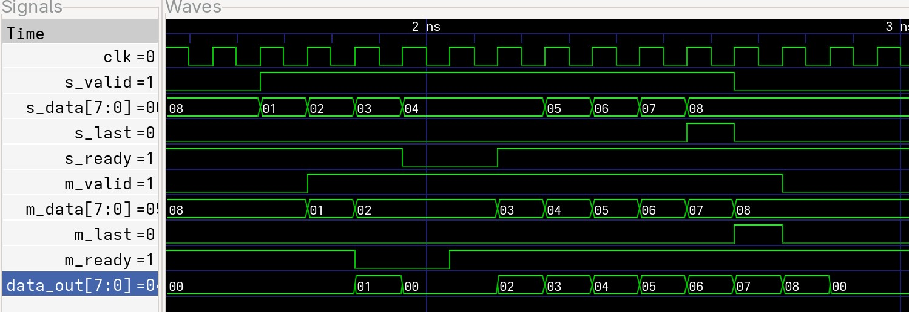
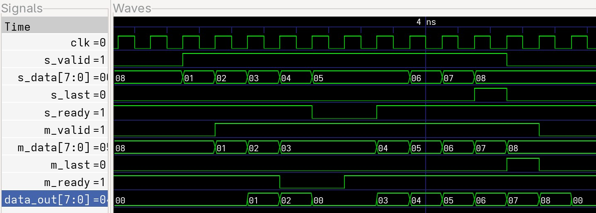
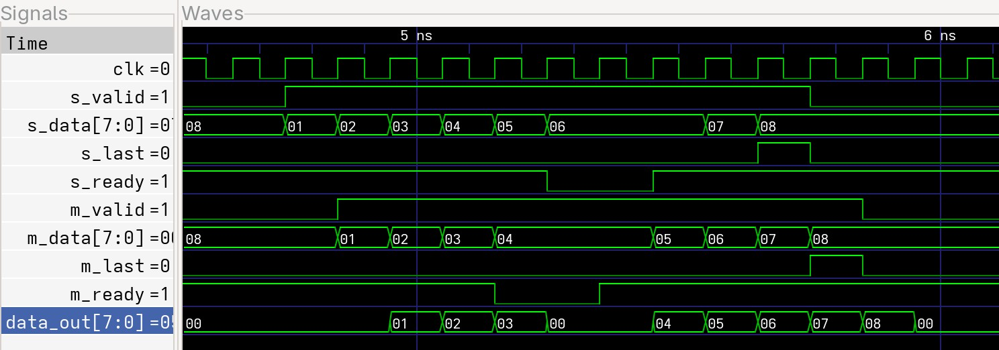
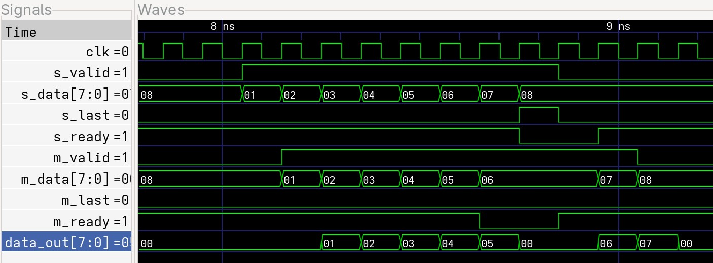

# Задание 4 (SkidBuffer)

## Задание

Сделать SkidBuffer для AXI-stream с сигналами valid, data, last, ready.

Сигнал data может быть любой размерности.

## Решение

Введём понятие состояния - STATE:

| STATE | Значение | Что делаем |
| 0 | Обычная работа | Выдаём состояния входы на выходы |
| 1 | Буферизация | Сохраняем вход и при готовности Slave сначала выдаём ему запомненное значение |

Также введём два условия перехода состояний:

| Название | Значение | Условие |
| STATE_0_TO_1 | Переходим из состояния 0 в 1 | STATE == 0 and (m_ready == 0 and s_ready == 1) |
| STATE_1_TO_0 | Переходим из состояния 1 в 0 | STATE == 1 and m_ready == 1 |

Во время перехода из 0 в 1 мы не передаём данные от master к slave а запоминаем их.

Во время перехода из 1 в 0 мы передаём данные из памяти, а потом начинается нормальный режим работы и данные возьмуться у master.

## Реализация

Временная диаграмма передачи пакета без прерываний (_[7:0]data_out_ - сигнал выхода AXI_slave):

Далее показаны временные диаграммы в которых передача пакета данных прерывалась после прихода различных битов.

Также был проверен пакет данных, где шло 2 прерывания подряд. Временная диаграмма:

## Заключение

На основе представленных выше временных диаграмм можно сделать вывод о работоспособности модуля:

1. В обычном режиме работы данные передаются напрямую,

2. Если приходит прерывание, то модуль отрабатывает штатно, данные не теряются,

3. Если приходит несколько прерываний подряд, то передача затягивается, но данные всё равно не теряются.
