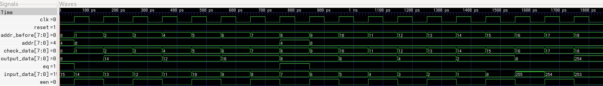
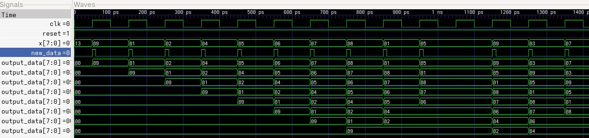
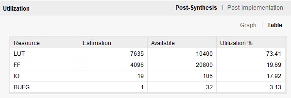

# Задание 3 (LU cache)

## Задание

Сделать модуль аналогичный LU cache: если пришедшего числа нет в памяти, то все ячейки смещаются, а число ставиться в начало.

Если число в памяти есть, то он ставиться в начало смещабтся только числа перед ним.

важно обеспечить маштабируемость задачи.

## Решение

К каждой ячейке памяти мы ставим ассинхронный XOR соединённый с выходом, если число будет равно выходу, то XOR выдаст маску из 0.

Далее на выход каждого XOR ставим ИЛИ-НЕ, таким образоме, если XOR выдаст все 0, но на выходе ИЛИ-НЕ будет 1.

Как только какая-то ячейка устанавливает свой выход ИЛИ-НЕ в 1, она сразу же выдаёт свой адрес на общую шину. Каждая другая ячкейка видит этот адрес и если он больше или равен её адресу, то она записывает значение предыдущей ячейки.

Ко всем выходам ИЛИ-НЕ подключён логический блок, который будет выдавать приоритетный сигнал разрешения записи, если он увидит, что новые данные пришли, а ни одна из чеек не выставила выход ИЛИ-НЕ в 1.

## Реализация

Для начала были реализованы блоки XOR и ИЛИ_НЕ. Их временные диаграммы представлены на рисунках:

Далее на их основе была реализована ячейка памяти, которая при совпадении с входными данными выдаёт свой адрес и выходной сигнал ИЛИ-НЕ (eq). Временная диаграмма:

Далее был собран основной модуль из множества _memory_cell_. Временная диаграмма:

Дополнительно был проведён синтез и имплементация в Vivado, результаты которых отображены на картинках ниже (задавался модуль с 512 ячейками памяти по 8 бит):

## Заключение

На основе представленных выше временных диаграмм можно сделать вывод о работоспособности модуля:

1. Когда приходит новое число оно записывается в начало а всё остальное сдвигается

2. Когда приходит число, которое уже есть в памяти, оно переносится в начало, а сдвигаются только числа перед ним.

