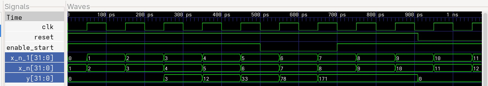

# Задание 1 (фильтр)

## Задание

Разработать модуль, вычисляющий следующую последовательность:

> yn = a * yn-1 + b * xn

Умножение занимает 2 такта (y0=0). Для этого использовать модули умножения с задержкой в 2 такта.

Значения могут появляться не сразу, но должны соответствовать рассчитанным значениям (a=2, b=3):

| Такт | 1 | 2 |  3 |  4 |  5 |
|:----:|:-:|:-:|:--:|:--:|:--:|
|   x  | 0 | 1 |  2 |  3 |  4 |
|   y  | 0 | 3 | 12 | 33 | 78 |

## Решение

В лоб решить задачу не возможно, т.к. yn-1 просто не будет готов для расчёта yn.

Тогда решением является подставить yn-1 = a * yn-2 + b * xn-1. Тогда остаётся только посчитать следующее выражение:

> yn = a**2 * yn-2 + a * b * xn-1 + b * xn

## Реализация

Для решения данной задачи было написано 3 модуля.

### Умножение (mult_2t)

Модуль вычислет результат умножения 2 числе пришедших на его входы, с задержкой в 2 такта.

Временная диаграмма:

### Вычисление последовательности (sequence)

Модуль вычисляет значение раскрытого выражения, причём в качестве yn-2 он берёт то же y? которое получил в данном такте.

Временная диаграмма:

### Главный модуль (filter)

Модуль с помощью двух модулей sequence вычисляет итоговый y.

Временная диаграмма:

## Заключение

На основе временных диаграмм можно сказать, что задание выполнено.

## Структура проекта

+filter                                 - папка проекта
|   - code                              - папка с файлами с verilog кодом
|   |   - filter.v                      - файл с кодом модуля filter
|   |   - mult_2t.v                     - файл с кодом модуля mult_2t
|   |   - sequence.v                    - файл с кодом модуля sequence
|   - simulation                        - папка с результатами симуляций
|   |   - files                         - папка с файлами симуляций
|   |   |   - filter_dsn                - файл с симуляцией
|   |   |   - filter_simulation.vcd     - файл с симуляцией для gtkwave
|   |   |   - mult_2t_dsn               - файл с симуляцией
|   |   |   - mult_2t_simulation.vcd    - файл с симуляцией для gtkwave
|   |   |   - sequence_dsn              - файл с симуляцией 
|   |   |   - sequence_simulation.vcd   - файл с симуляцией для gtkwave
|   |   - images                        - папка с временными диаграммами
|   |   |   - filter.jpg                - временная диаграмма модуля filter
|   |   |   - mult_2t.jpg               - временная диаграмма модуля mult_2t
|   |   |   - sequence.lpg              - временная даиграмма модуля sequence
|   - testbenches                       - папка с testbench
|   |   - filter_tb.v                   - testbench для модуля filter
|   |   - mult_2t_tb.v                  - testbench для модуля mult_2t
|   |   - sequence_tb.v                 - testbench для модуля sequence
