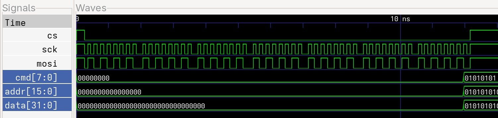
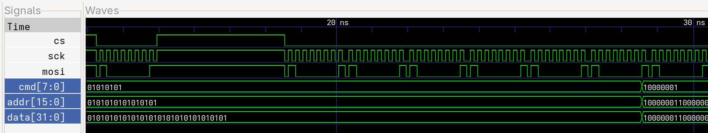

# Задание 2 (SPI)

## Задание 

Необходимо принимать по SPI байты, а затем выдавать их в параллельном коде (SPI Slave).

Структура  сообщений:
- 1 байт  : команды
- 2 байта : адрес
- 4 байта : данные

## Решение

Решение просто: отслециваем изменение CS, если он 0, то начинаем записывать пришедшие байты в память. Как только придут все 7 байт выдаём на выход данные и на 1 такт выставляем флаг.

## Реализация

Для удобной передачи данных на slave был написан отдельный модуль SPI master. Временная диаграмма его работы:

При получении сигнала EN модуль сохраняет в память данные, пришедшие на вход. А затем побайтно выдаёт их на выход, по тактовому сигналу SCK.

Период SCK в два раза больше, чем CLK.

Далее был написал модуль SPI slave. По тактовому сигналу SCK, если опущен подключённый CS, он записывает значения сигнала MOSI во временный байт _temp_byte_ и увеличивает счётчик _counter_bit_. 

Для этого используется блокирующее присваивание, чтобы можно было сразу работать с новыми данными. Это важно т.к. модуль полностью работает только на тактовом сигнале SCK и не имеет собственного тактового сигнала => после последнего переданного бита, у нас просто не будет времени, чтобы записать байт в память.

Как только счётчик _counter_bit_ == 7 => все биты во временном байте заполнены. Байт записывается в память по адресу _counter_byte_, данный счётчик увеличивается, а счётчик битов сбрасывается.

Если _counter_bit_ == 7 и _counter_byte_ == 6, то есть был записан последний бит. то устанавливается флаг _rf_ (result flag), по фронту которого оба счётчика сбрасываются, а значения, записанные в память выдаются на выходы.

Временная диаграмма модуля SPI slave при непрерывном получении (передаётся 10101010):

Временная диаграмма модуля SPI slave при получении сначала одного, а потом всех остальных байтов (передаётся 10000001):

## Заключение

На основе временных диаграмм можно сделать вывод, что задание выполнено корректно.

## Структура проекта

> SPI                           - корневая папка проекта
>
>> code                         - папка с файлами с кодом
>>
>>> SPI_master.v                - файл с кодом модуля SPI Master
>>>
>>> SPI_slave.v                 - файл с кодом модуля SPI Slave
>>
>> simulation                   - папка с результатами симуляции
>>
>>> files                       - папка с файлами симуляции
>>>
>>>> SPI_master_dsn             - файл симуляции модуля SPI Master
>>>>
>>>> SPI_master_simulation.vcd  - файл симуляции для GTKWAVE модуля SPI Master
>>>>
>>>> SPI_slave_dsn              - файл симуляции содкля SPI Slave
>>>>
>>>> SPI_slave_simulation.vcd   - файл симуляции для GTKWAVE модуля SPI Slave
>>>
>>> images                      - папка с изображениями временных диаграмм
>>>
>>>> SPI_master.jpg             - временная диаграмма модуля SPI Master
>>>>
>>>> SPI_slave_v1.jpg           - временная диаграмма непрерывной передачи модуля SPI Slave
>>>>
>>>> SPI_slave_v2.jpg           - временная диаграмма прерываемой передачи модуля SPI Slave
>>
>> testbenches                  - папка с testbench
>>
>>> SPI_master_tb.v             - testbench для модуля SPI Master
>>>
>>> SPI_slave_tb.v              - testbench для модуля SPI Slave
